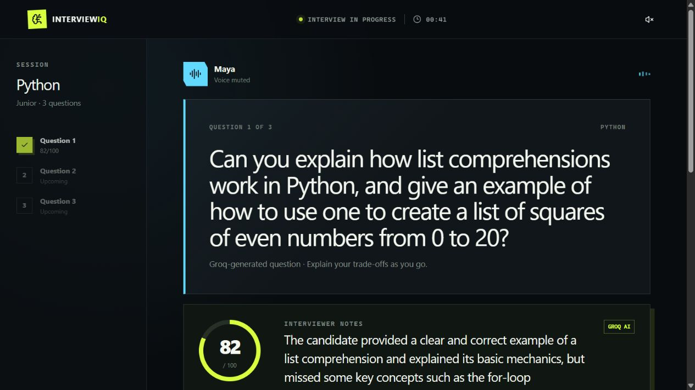

# InterviewIQ — Python + FastAPI AI Interviewer

[Live demo](https://interviewiq-ledf.onrender.com) · [GitHub](https://github.com/mfslovely/interviewiq-ai-interviewer)

Practice technical interviews with contextual questions, Python coding exercises, follow-up discussions, weighted feedback, and neural voice.

## Actual technology stack

| Layer | Technology |
| --- | --- |
| Backend / HTTP server | **Python, FastAPI, Uvicorn** |
| Validation | Pydantic |
| AI integration | Groq via async HTTPX |
| Neural voice | Groq Orpheus English |
| Frontend | React, TypeScript, Tailwind CSS, Radix UI |
| Frontend build tools only | Vite, Node.js / npm |
| Hosting | Render, GitHub auto-deploy |
| Database | None; interview state is kept in browser memory |

**All API logic is Python.** There is no Node.js API server, Next.js server, or JavaScript proxy in the request path. FastAPI serves both the APIs and compiled React files. Node/npm are only frontend development/build tools (the existing Render service uses an npm launcher that starts Python).

## Screenshots




## Features

- Seven tracks: Python, full-stack, RAG, GenAI/LLMs, frontend, AWS, and DSA.
- 35 curated fallback questions, separated by topic into JSON files shared by Python and React.
- Groq-generated questions based on topic, junior/mid/senior level, previous questions, last answer and feedback.
- Separate question-generation and scoring prompts in `backend/prompts.py`.
- Server-calculated scoring: concepts 50%, correctness/context 35%, clarity 10%, grammar 5%. Equivalent explanations count; keyword stuffing does not.
- Strict JSON-schema provider output plus Pydantic validation.
- Python editor, examples, constraints, reference solutions, and complexity explanations.
- Neural English voice with browser-speech fallback, microphone transcription, and mute controls.
- Signed, four-hour question tokens; server-side API key; body-size limits.
- Clearly labelled curated/ungraded fallbacks if Groq is unavailable.

**Candidate code is reviewed, not executed.** No Python execution sandbox is exposed to users. This remains an interview-practice tool, not a validated hiring assessment. Session state resets on refresh.

## Run locally (Windows PowerShell)

Requirements: Python 3.11+ and Node.js 22.13+ (for building React).

```powershell
cd interviewiq
python -m venv .venv
.\.venv\Scripts\python.exe -m pip install -r requirements-dev.txt
npm ci
npm run build:frontend
```

Create `interviewiq/.env.local` from `.env.example` only if it does not already exist:

```dotenv
GROQ_API_KEY=your_key_here
GROQ_MODEL=openai/gpt-oss-20b
GROQ_TTS_VOICE=hannah
```

Do not put real secrets in `.env.example` or commit `.env.local`. Python loads this local file without overriding Render environment settings.

Start the Python server:

```powershell
.\.venv\Scripts\python.exe -m backend
```

Open [localhost:8000](http://localhost:8000). FastAPI docs: [localhost:8000/docs](http://localhost:8000/docs).

On Linux/macOS, use `.venv/bin/python` instead of `.venv\Scripts\python.exe`.

For frontend hot reload, keep FastAPI on port 8000 and run `npm run dev` in a second terminal. Vite proxies `/api` to Python during development only. Production has one Python server and no proxy.

## Backend structure

```text
interviewiq/
  backend/
    main.py              FastAPI routes, fallbacks, static frontend serving
    __main__.py          Uvicorn entry point (0.0.0.0:$PORT)
    models.py            Pydantic request/provider schemas
    provider.py          Async Groq chat and neural speech client
    prompts.py           Separate generation and scoring instructions
    security.py          HMAC signing, verification, expiry
    question_banks/      python.json, fullstack.json, rag.json, genai.json,
                         frontend.json, aws.json, dsa.json
    tests/test_api.py    Mock-provider regression and security tests
  src/main.tsx           React entry point
  app/interview-studio.tsx
  lib/use-interviewer-voice.ts
  requirements.txt       Pinned Python runtime dependencies
  requirements-dev.txt   Test dependencies
  dist/                  Generated frontend files (ignored)
```

| Endpoint | Purpose |
| --- | --- |
| GET /api/health | Health and Python/FastAPI runtime identification |
| POST /api/question | Contextual question generation |
| POST /api/interview | Answer/code and follow-up scoring |
| POST /api/speech | Neural WAV audio |
| GET /docs | FastAPI Swagger UI |

## Verification

```powershell
.\.venv\Scripts\python.exe -m pytest backend/tests -q
npx tsc --noEmit
npm run lint
npm run build:frontend
```

Tests use a fake provider, not the real API key. They cover scoring math, generated questions, signed-token tampering/expiry, question context, follow-up context, body limits, invalid JSON, provider outages, WAV responses, static serving, and secret-file protection.

Optional HTTP smoke tests (server already running):

```powershell
$env:TEST_BASE_URL='http://localhost:8000'
node --test scripts/interview-smoke.test.mjs
```

These smoke tests call Groq if the running server has a key, so provider usage may apply.

## Render deployment

The root `render.yaml` defines a Python service:

- Root directory: `interviewiq`
- Build: `npm ci && npm run build:frontend && pip install -r requirements.txt`
- Start: `python -m backend`
- Health: `/api/health`
- Secret: `GROQ_API_KEY`
- Model: `openai/gpt-oss-20b`
- Voice: `hannah`

For the existing service URL, backward-compatible build/start scripts install a Python virtual environment and launch Uvicorn. Its earlier Render native runtime selection may still display Node; that is a platform/build setting, not the application's backend. No Node web server is launched.

All calls use the same Groq key. Orpheus terms must be accepted in Groq Console. Neural speech is English, not Hindi/Hinglish. Browser microphone support varies. Free Render instances can sleep when idle.

## Privacy and remaining limitations

Answers, code and recent interview context are sent to Groq; interviewer text is sent for speech synthesis. Browser speech recognition may use the browser vendor's servers. Never submit secrets. Audio is AI-generated. There is no app database or saved interview history.

Authentication, distributed rate limiting, and sandboxed code execution are not implemented. Add access/usage controls before broad public use of a paid API key.
