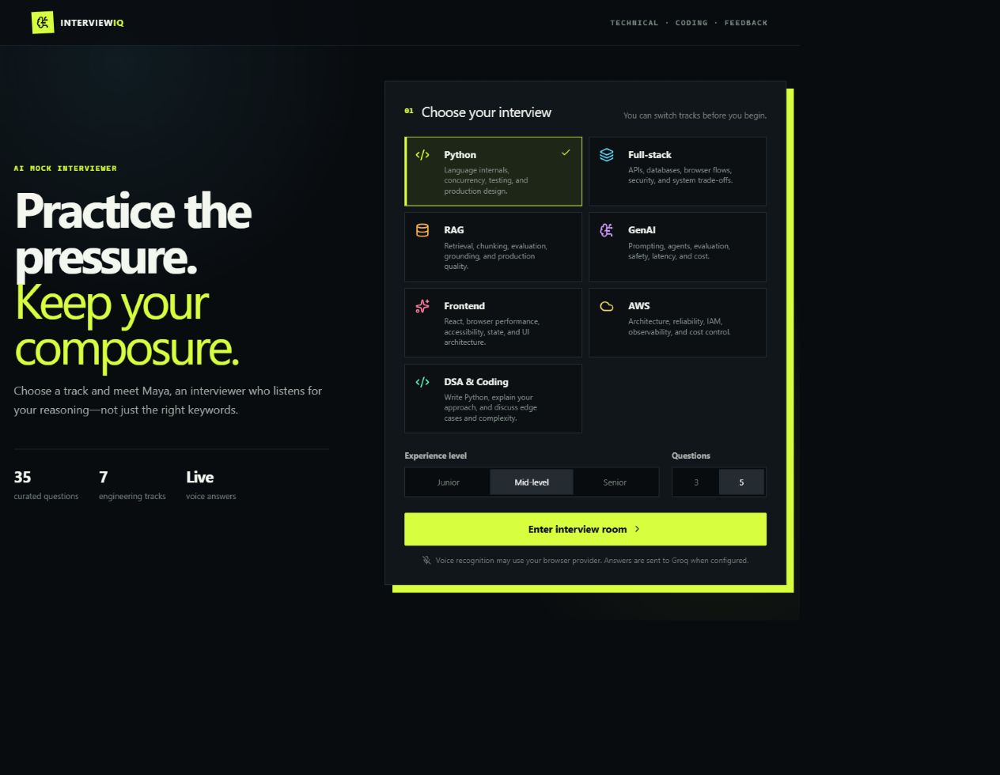
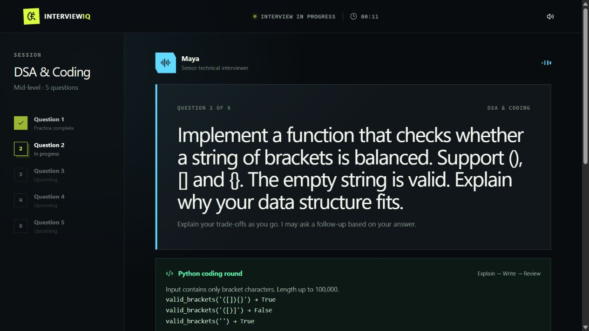
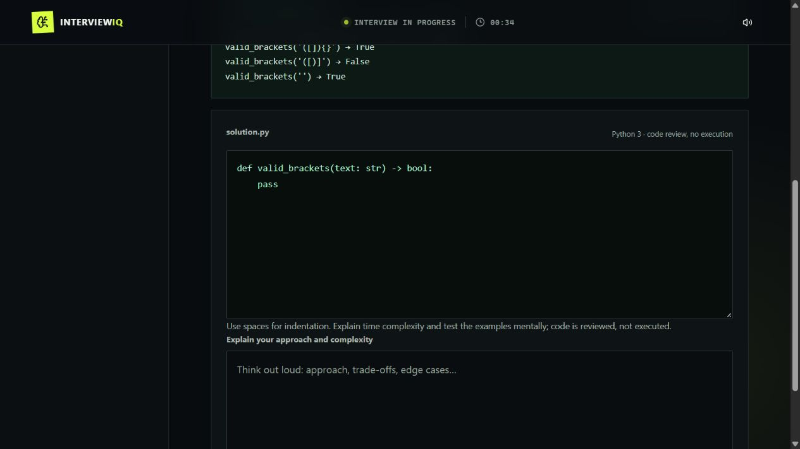

# InterviewIQ — AI Technical Interviewer

Practice a technical interview with Maya: explain your reasoning, write Python, answer follow-up questions, and compare your approach with reference answers.

[Open the live demo](https://interviewiq-ledf.onrender.com)

## Screenshots

Real screenshots captured from the running application.







## Features

- 35 curated questions across Python, full-stack, RAG, GenAI/LLMs, frontend, AWS, and DSA.
- Separate, editable TypeScript question-bank files for each track.
- Junior, mid-level, and senior review settings; three- or five-question sessions.
- Conversational prompts, spoken questions, optional voice answers, and follow-up discussion.
- Python coding editor with starter functions, examples, constraints, reference solutions, and complexity explanations.
- Groq-generated questions adapted to topic, seniority, previous questions, last answer, and feedback.
- Groq Orpheus neural English voice (Hannah by default), with labelled browser-speech fallback and mute control. Long utterances are split into chunks of up to 200 characters.
- Separate generation/scoring prompts with feedback, reference answers, and a visible scoring breakdown: concepts/keywords 50%, correctness/context 35%, clarity 10%, grammar 5%. Correct synonyms count; keyword stuffing does not.
- Honest demo mode: reference practice remains available without an API key, but no AI score is assigned.

## Coding round

Choose **DSA & Coding**, enter the interview room, explain your approach, and write your solution. After submitting, discuss Maya's follow-up or reveal the reference solution.

Included exercises: Two Sum, balanced brackets, longest unique substring, merge intervals, and binary search. Each covers edge cases and time/space complexity.

**Code is reviewed, not executed.** There is no Python runtime or sandbox in this application. AI feedback can be wrong; test solutions independently. Groq generates new questions when configured; the 35 curated questions remain a clearly labelled fallback. Generated questions are signed server-side to prevent changing the reference before scoring, and expire after four hours.

## Run locally

Requirements: Node.js 22.13+ and npm.

```sh
git clone https://github.com/mfslovely/interviewiq-ai-interviewer.git
cd interviewiq-ai-interviewer/interviewiq
npm ci
```

Copy `.env.example` to `.env.local`, then configure:

```dotenv
GROQ_API_KEY=your_groq_api_key
GROQ_MODEL=llama-3.3-70b-versatile
GROQ_TTS_VOICE=hannah
```

Keep the key server-side. Never commit environment files or put the key in a public/browser variable. Leave the key empty to use ungraded demo mode.

The same Groq key powers question generation, scoring, and neural TTS. Add it yourself in **Render → service → Environment → GROQ_API_KEY**, then save/redeploy. No real key is included in this repository. Neural speech requires access to `canopylabs/orpheus-v1-english`; provider access/usage charges apply. This voice is English, not Hindi/Hinglish. Available English voices include `hannah`, `autumn`, `diana`, `austin`, `daniel`, and `troy`; see [Groq's official speech documentation](https://console.groq.com/docs/text-to-speech/orpheus).

```sh
npm run dev
```

Open the localhost address printed by the server.

## Project structure

```text
interviewiq/
  app/interview-studio.tsx       Interview room and coding UI
  app/api/interview/route.ts    Validated server-side Groq review
  app/api/interview/review.ts   Request and response schemas
  app/api/health/route.ts       Health check
  app/api/question/route.ts     Contextual Groq question generation
  app/api/speech/route.ts       Server-side Orpheus neural speech
  lib/interview-prompts.ts      Separate generation and scoring prompts
  lib/scoring.ts                Server-enforced weighted score
  lib/use-interviewer-voice.ts  Audio playback, cancellation, and fallback
  lib/question-banks/
    python.ts                  Python interview questions
    fullstack.ts               Full-stack questions
    rag.ts                     RAG questions
    genai.ts                   GenAI and LLM questions
    frontend.ts                Frontend questions
    aws.ts                     AWS questions
    dsa.ts                     Python coding exercises and solutions
    types.ts                   Shared question types
render.yaml                    Render deployment configuration
docs/screenshots/              Actual application screenshots
```

Built with React, TypeScript, Tailwind CSS, shadcn-style components, and Vinext/Vite using Next-compatible app routes. No database is required for the current interview flow. Session state lives in the browser and resets on reload.

## Checks

```sh
npx tsc --noEmit
npm run lint
npm run build
npm run start:render
```

With the server running, execute the API smoke tests in another terminal:

```sh
node --test scripts/interview-smoke.test.mjs
node --experimental-strip-types --test scripts/ai-contracts.test.mjs
```

The smoke tests default to `http://localhost:3000`; set `TEST_BASE_URL` to test another local port. They verify validation and response contracts, not the quality of a live model's review.

## Render deployment

Use the root `render.yaml` Blueprint, or configure a Node web service:

- Build: `cd interviewiq && npm ci && npm run build`
- Start: `cd interviewiq && npm run start:render`
- Health check: `/api/health`
- Set `GROQ_API_KEY` as a secret in the Render dashboard.
- Optional model override: `GROQ_MODEL`.

The server binds to `0.0.0.0` and uses Render's `PORT`. The existing service deploys automatically from `main`. Free instances may take time to wake after inactivity.

## Privacy and limitations

When configured, answers, code, and recent interview context are sent to Groq for generation/review; spoken interviewer text is sent for neural speech. Audio is AI-generated, not a real interviewer. Browser speech recognition may use the browser provider's service; support varies by browser. Do not submit secrets or confidential interview material. The app does not intentionally persist interview transcripts, but hosting/provider logging and retention policies still apply.

This is a practice app, not an assessment or hiring decision system. It currently has no authentication or request rate limiting; add access controls and usage limits before exposing a paid API key to unrestricted public traffic.
